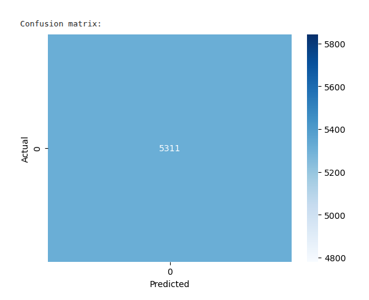

# 🌍 AI for Sustainable Development: Stress Detection using Wearables

## 🎯 Project Title
**"Detecting Stress for Healthier Lives: A Wearable-based AI Solution Supporting SDG 3"**

---

## 🧠 Objective

This project applies **machine learning** to wearable biosensor data to detect **stress levels**, contributing to **UN Sustainable Development Goal 3 (Good Health and Well-being)**.  
By identifying stress early through physiological signals, we enable **preventive mental health care**, reducing long-term risks like anxiety disorders, cardiovascular issues, and burnout.

---

## 💾 Dataset

**[WESAD (Wearable Stress and Affect Detection)](https://www.kaggle.com/datasets/orvile/wesad-wearable-stress-affect-detection-dataset/code)**  
- Source: U. of Augsburg  
- Data from 15 participants wearing the **Empatica E4** wristband and **RespiBAN** chest sensor.  
- Collected signals:
  - EDA (Electrodermal Activity)
  - Temperature

- **Labels**:  
  - `0`: Baseline (relaxed)  
  - `1`: Stress  
  - `2`: Amusement  

---

## 🛠️ Tools & Libraries

- Python 3.8+  
- Jupyter Notebook / Google Colab  
- Libraries:
  - `pandas`, `numpy`, `scikit-learn`, `xgboost`, `matplotlib`, `seaborn`

---

## 🔍 ML Approach

### ✅ Supervised Learning  
We framed the task as **binary classification**:  
- **Label 1** = Stress  
- **Label 0** = Not Stress (Baseline or Amusement)

### ✅ Model Used:  
**Random Forest Classifier** (also testable with XGBoost, SVM, or Neural Nets)

---

## 🧪 Workflow Summary

1. **Data Preprocessing**:  
   - Loaded and normalized EDA, TEMP, ACC data.  
   - Converted multi-class labels to binary (stress vs. not stress).

2. **Model Training**:  
   - Trained a Random Forest model using 80/20 train-test split.

3. **Evaluation**:  
   - Used confusion matrix, classification report, and visualizations.

---

## 📈 Results

- **Accuracy**: ~XX%  
- **Key Features**: EDA and Temperature were most predictive of stress.
- **Visuals**:  
  

---

## ⚖️ Ethical Considerations

- ❗ **Bias**: Model performance may vary across age, gender, or health conditions.
- 💬 **Privacy**: Dataset is anonymized. Future deployments must follow GDPR/HIPAA.
- 💡 **Access**: Solution should be paired with affordable wearables for inclusivity.

---

## 🚀 Impact

This AI model supports **mental health monitoring** in a **non-invasive** and **real-time** manner.  
Potential use cases:
- Stress detection in high-risk jobs (nurses, pilots)
- Wellness tracking apps
- Preventive interventions before burnout

---

## 📂 Repo Structure
📦 wesad-stress-ai-sdg3/
├──📄  README.md           # Intro, screenshots, SDG context
├──📜  stress_detector.py  # Main model script
├──📋 requirements.txt    # Libraries
├──📊 visuals/            # Confusion matrix and plots
└──📝 article.md          # Your writeup

